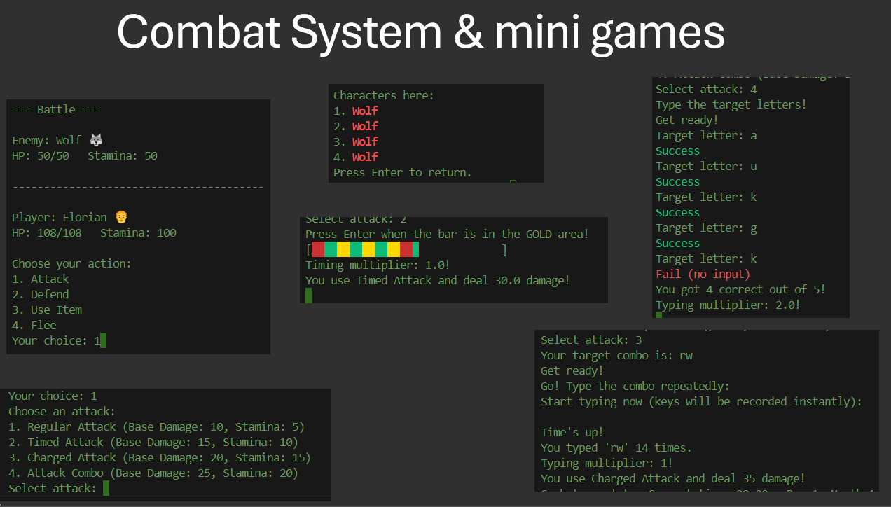
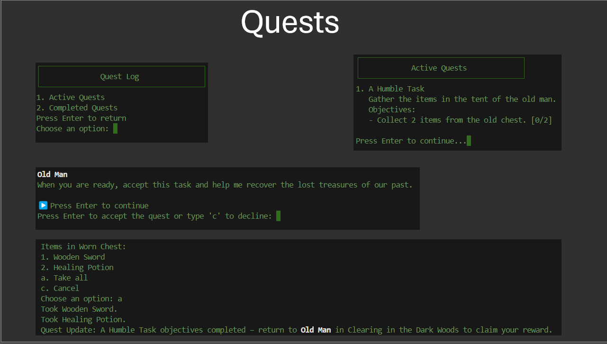
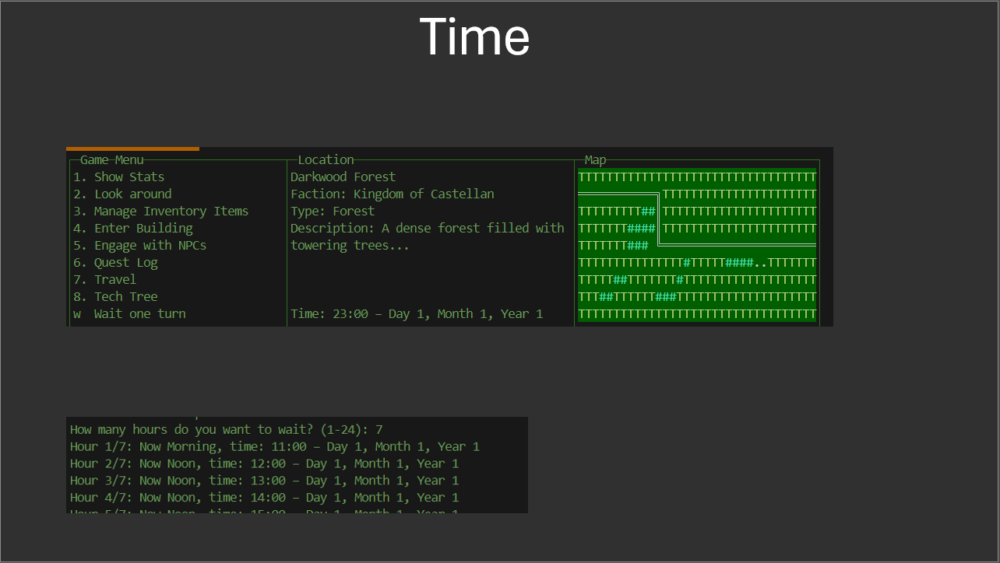
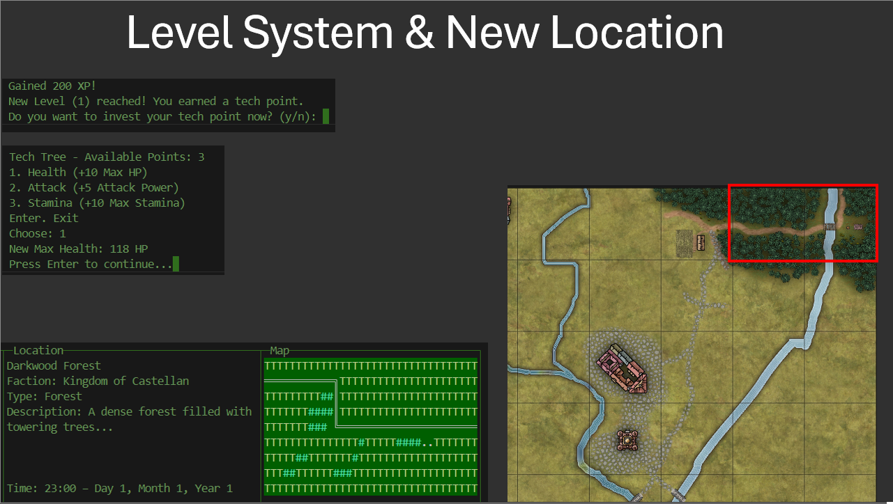

# 🏹 TerminalRPG 🏰
👷‍♀️ **Under Construction!** 👷‍♂️  
A terminal-based RPG adventure. Currently in development! 

## About the Project
TerminalRPG is a medieval **text-based role-playing game** that runs in the terminal.  
The goal is to create an **interactive world** where players can:
- Explore the **world** 🏘️
- Engage in **battles** ⚔️
- Manage an **inventory** 👜
- Interact with **NPCs** 👩‍🌾
- Gain experience and get stronger over time 💪

## 🧙 Installation
1. Clone this repository:
   ```bash
   git clone https://github.com/fl97-mo/TerminalRPG.git
2. Install requirements:
   ```bash
   pip install -r requirements.txt
3. Navigate to the project folder:
   ```bash
   cd TerminalRPG
4. Run the game:
   ```bash
   python main.py


## 🧾 Dev Diary

### Day 5,6,7,8 and 9:

### Combat system
Implemented a the base for the combat system. Regular attacks or minigames can be used to deal damage.
Damage is calculated based on the heros skills, items equipped and base damage from the attack itself.
Its planned to be expanded in future.
Enemies can spawn, be killed and respawn in defined locations. If an enemy is defeated, the hero earns Gold, XP and
Items can drop.


### Quest system
Quests can be accepted or declined. Quests give certain conditions, and if fullfilled, rewards the Hero.
Quests have trigger condtions, example "Take x amount of y in z": - triggers defined within those.
First quests to test are implemented as well.


### Time system
A round based time system is implemented as well. Currently one round = 1 hour. Travelling from one place to another is 
one round. Each in game hour passed, the hero recovers health and stamina points.
The time system is based on a fictional one, so it has 15 months instead.


### Level system & Map
If a character levels up, they get one Tech Point which they can invest (currently) in health, stamina or attack points.
Tech points can stack, so after implementing a more advanced tech tree, the hero can decide if they save up the points, or invest it immediately. A hero can travel only to neighboring provinces.
There will be probably many locations, so I decided to create a worldmap in inkarnate to create a simple overview.
The already available locations are framed red here.


Created:

- **`battle_system.py`**:     Manages and simulates the battles.
- **`quest_manager.py`**:     Handles quest and manages them.
- **`quests.py`**:            Creating quest objects
- **`tech_tree.py`**:         Current implementation of the tech tree.
- **`time_system.py`**:       Handles ingame time, round-based.

- **`attacks.json`**:         Defining attacks and their stats.
- **`quests.json`**:          Defines quests and their conditions, rewards, etc..

### Day 4:

### Inventory
2-column inventory with stats, equipment, backpack and inventory management options


### Building/Location Menu
This is what the menu of buildings and locations looks like. 
On the right, the map visualised with the colours. (it is the same map twice, as a placeholder)


### Dialogs
Dialogues are dynamic and npc`s (or even the hero) react differently depending on the input. 
There are (*will be*) many possible answers with different texts.


Created:

- **`menu.py`**:              Splitted into: `building_menu.py`, `dialog_menu.py`,
                              `game_menu.py`, for a better overview
- **`asciimap.py`**:          Class to design and paint maps
- **`colors.py`**:            Contains ~ 50 asni colors, backgrounds and formats
- **`location_manager.py`**:  Controls the movement of a character from one place to another
- **`map_manager.py`**:       Reads and draws map and banner
- **`npc_manager.py`**:       Loads npc's and paints attitude towards hero
- **`ui_helpers.py`**:        Methods for a clear design of the ui

- **`npcs.json`**:            Defines NPC: name, role, attitude, faction, id...
- **`maps.json`**:            Contains the visualisations, inlc. different color themes (asciimap.py)
- **`locations.json`**:       Defines Locations, name, type, ids, descriptions etc.

Implemented:

✅ **Locations**
- Hero and NPC can enter and move Locations
- Three types of location: 1. Location 2. Building 3. Containers
1. Location: e.g. Capital city
2. Building: e.g. Smith in the Capital city
3. Containers: e.g. Chest in the Smith with items that can be collected

✅ **Visualisations**
- Menu has three colums (text wrapped within column)
- Left: Options | Middle: Location infos | Right: Visualisation of location
- Maps with colors will be displayed in the terminal, designed the first location
- NPC's color change according to attitude, Hero has fixed color
- Different Themes for Maps planned, temperate forest, city, arid etc


### Day 3:
Created: 
- **`main.py`**:              Controls the game logic.
- **`character.py`**:         Represents all characters.
- **`item.py`**:              Represent all items.
- **`items.json`**:           Contains all created items.
Implemented:

✅ **Creation of Item Objects and Hero Object (Player)**

### Day 2:
Created: 
- **`initializeGame.py`**:    Handles the game initializing and the intro.
- **`dialog.py`**:            Methods to display dialogs in RPG Styles
- **`dialogues.json`**:       Contains all dialogs and options to response.

Implemented:

✅ **Logic for NPC conversation with those scenarios:**
- NPC talks in monologue
- NPC asks for user input
- NPC reacts to user input
