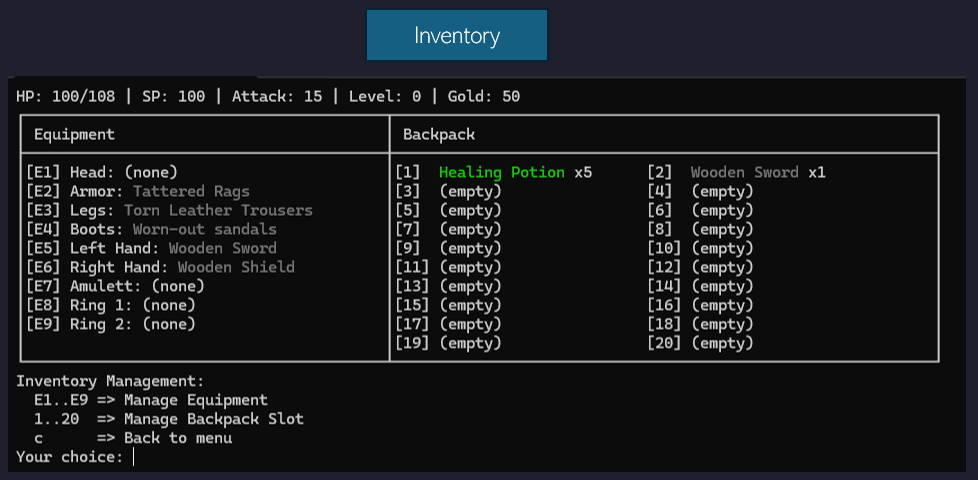
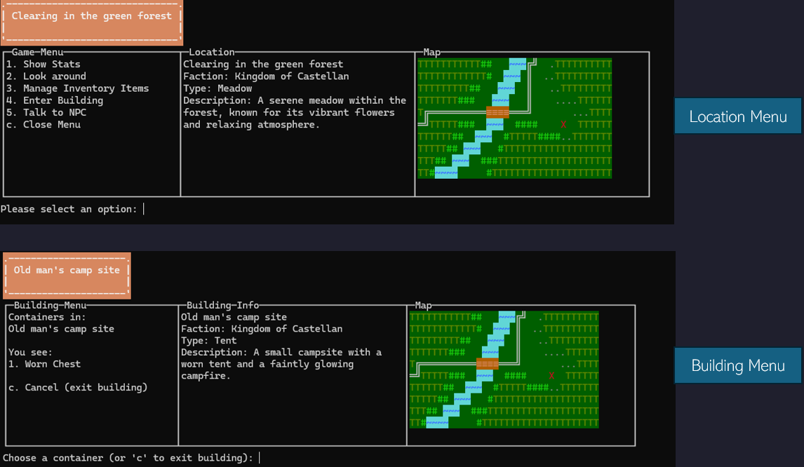
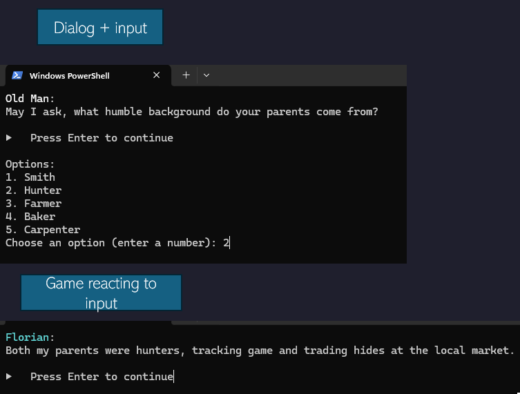

# 🏹 TerminalRPG 🏰
👷‍♀️ **Under Construction!** 👷‍♂️  
A terminal-based RPG adventure. Currently in development! 

## About the Project
TerminalRPG is a medieval **text-based role-playing game** that runs in the terminal.  
The goal is to create an **interactive world** where players can:
- Explore the **world** 🏘️
- Engage in **battles** ⚔️
- Manage an **inventory** 👜
- Interact with **NPCs** 👩‍🌾
- Gain experience and get stronger over time 💪

## 🧙 Installation
1. Clone this repository:
   ```bash
   git clone https://github.com/fl97-mo/TerminalRPG.git
2. Navigate to the project folder:
   ```bash
   cd TerminalRPG
3. Run the game:
   ```bash
   python main.py


## 🧾 Dev Diary

### Day 4:

### Inventory
2-column inventory with stats, equipment, backpack and inventory management options


### Building/Location Menu
This is what the menu of buildings and locations looks like. 
On the right, the map visualised with the colours. (it is the same map twice, as a placeholder)


### Dialogs
Dialogues are dynamic and npc`s (or even the hero) react differently depending on the input. 
There are (*will be*) many possible answers with different texts.


Created:

- **`menu.py`**:              Splitted into: `building_menu.py`, `dialog_menu.py`,
                              `game_menu.py`, for a better overview
- **`asciimap.py`**:          Class to design and paint maps
- **`colors.py`**:            Contains ~ 50 asni colors, backgrounds and formats
- **`location_manager.py`**:  Controls the movement of a character from one place to another
- **`map_manager.py`**:       Reads and draws map and banner
- **`npc_manager.py`**:       Loads npc's and paints attitude towards hero
- **`ui_helpers.py`**:        Methods for a clear design of the ui

- **`npcs.json`**:            Defines NPC: name, role, attitude, faction, id...
- **`maps.json`**:            Contains the visualisations, inlc. different color themes (asciimap.py)
- **`locations.json`**:       Defines Locations, name, type, ids, descriptions etc.

Implemented:

✅ **Locations**
- Hero and NPC can enter and move Locations
- Three types of location: 1. Location 2. Building 3. Containers
1. Location: e.g. Capital city
2. Building: e.g. Smith in the Capital city
3. Containers: e.g. Chest in the Smith with items that can be collected

✅ **Visualisations**
- Menu has three colums (text wrapped within column)
- Left: Options | Middle: Location infos | Right: Visualisation of location
- Maps with colors will be displayed in the terminal, designed the first location
- NPC's color change according to attitude, Hero has fixed color
- Different Themes for Maps planned, temperate forest, city, arid etc


### Day 3:
Created: 
- **`main.py`**:              Controls the game logic.
- **`character.py`**:         Represents all characters.
- **`item.py`**:              Represent all items.
- **`items.json`**:           Contains all created items.
Implemented:

✅ **Creation of Item Objects and Hero Object (Player)**

### Day 2:
Created: 
- **`initializeGame.py`**:    Handles the game initializing and the intro.
- **`dialog.py`**:            Methods to display dialogs in RPG Styles
- **`dialogues.json`**:       Contains all dialogs and options to response.

Implemented:

✅ **Logic for NPC conversation with those scenarios:**
- NPC talks in monologue
- NPC asks for user input
- NPC reacts to user input
